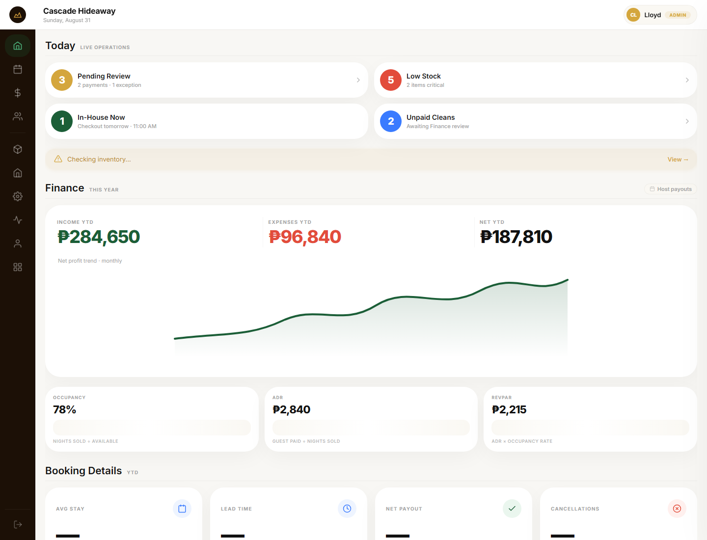
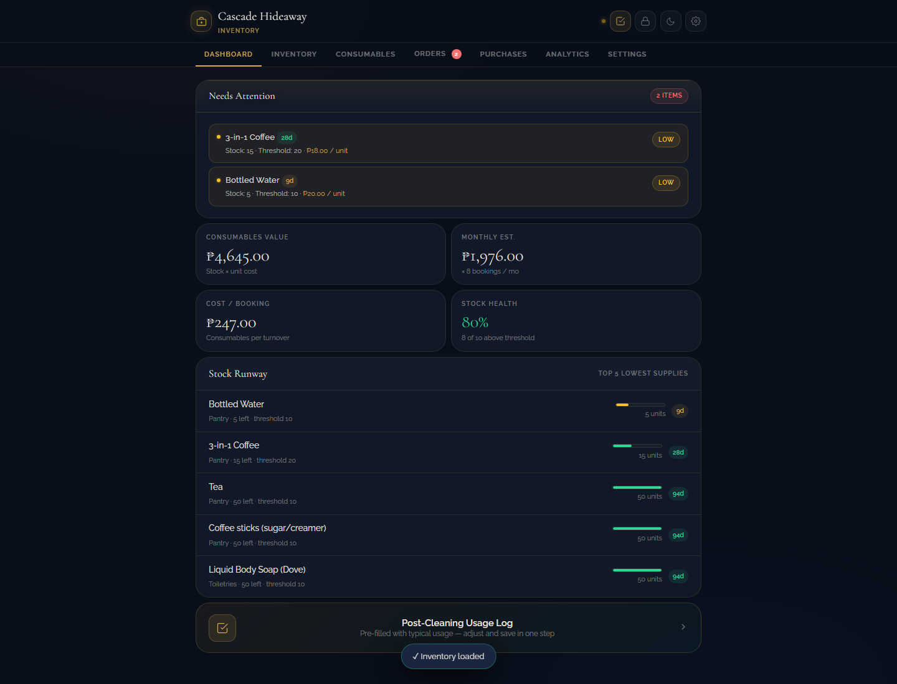
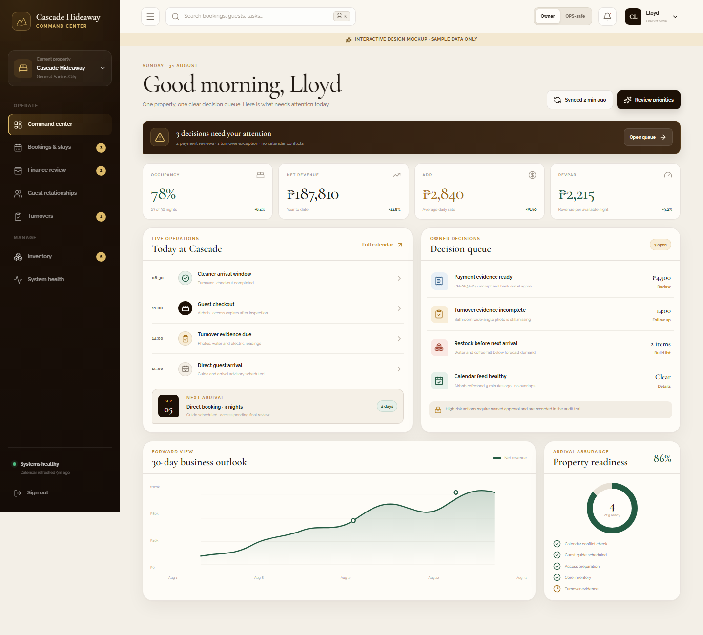
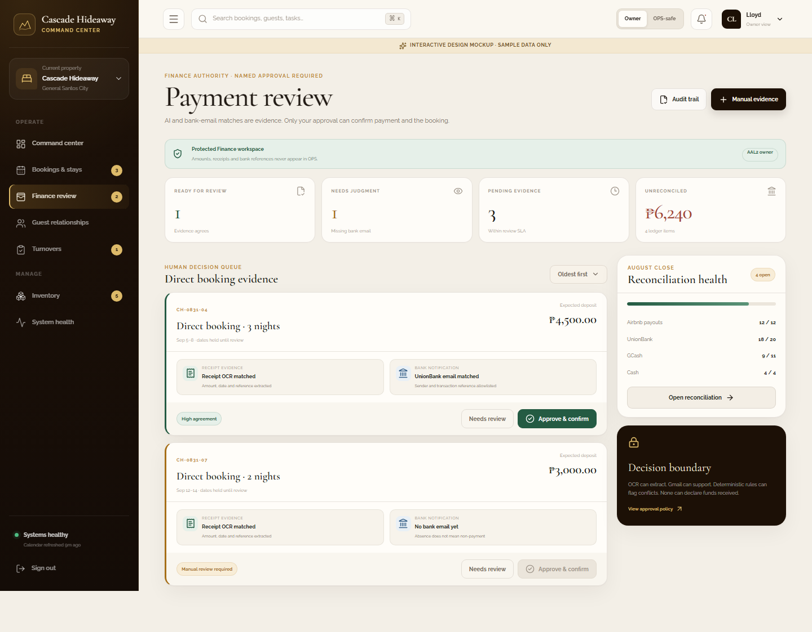
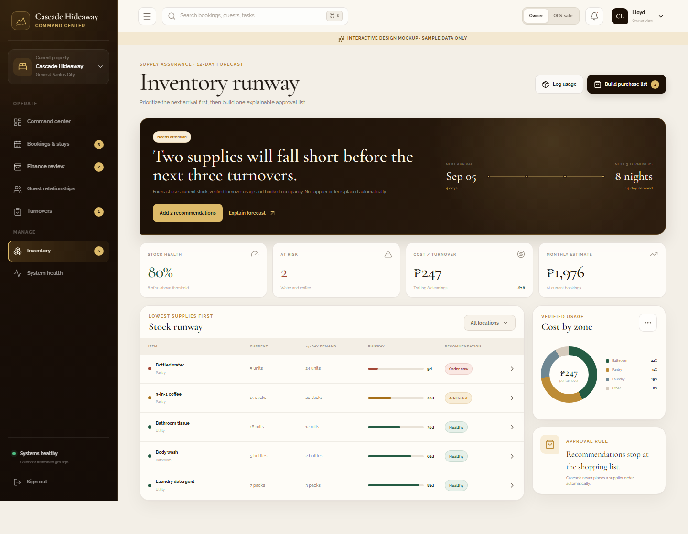
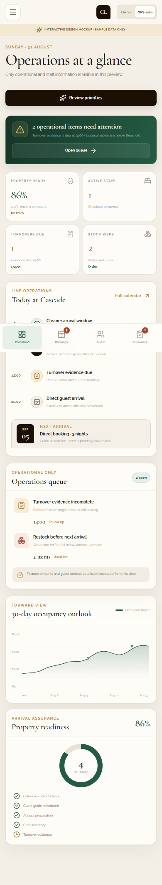
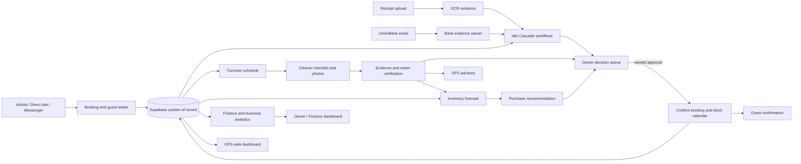

# Cascade Dashboard Design Audit and Command-Center Mockup

> **Superseded for mockup coverage on 2026-08-31.** The original dashboard concept is now expanded into the complete Command Center, Cleaner Checklist, and Direct Booking suite in [the product experience redesign audit](./2026-08-31-product-experience-redesign-audit.md).

**Date:** 2026-08-31
**Status:** Design direction approved for implementation planning; not production code
**Scope reviewed:** `cascade-admin-dashboard` at `c064f91`, `CH_Inventory` at `62f4c87`, and the current cleaner checklist PWA
**Interactive artifact:** [Open the Cascade Command Center mockup](./cascade-command-center-mockup.html)

## Executive verdict

The existing dashboards already cover most of the right business data, but they do not yet feel or behave like one operating system.

- The admin dashboard has broad coverage and useful finance views, but its generic light-SaaS styling, icon-only rail, dense cards, and finance-first emphasis make daily exceptions harder to see.
- The inventory dashboard has the strongest Cascade identity and the best action framing, but it underuses desktop width, relies on small low-contrast labels, and gives too many surfaces equal visual weight.
- The cleaner app establishes a suitable boutique-hospitality visual language. The proposed command center carries that warmth into a more operational, accessible desktop and mobile shell.

The main recommendation is to consolidate the dashboards around one role-aware shell and one decision queue. Owners should see money, risk, and approvals. OPS staff should see only operational and staff information—never guest payment amounts or other financial details.

## Current design assessment

| Dimension | Admin dashboard | Inventory dashboard | Recommended direction |
| --- | --- | --- | --- |
| First impression | Capable but generic SaaS | Distinctive luxury identity | Boutique hospitality with command-center clarity |
| Information hierarchy | Metrics and charts compete with urgent work | Attention panel is strong; lower cards have similar weight | Decisions first, today second, trends third |
| Navigation | Icon-only rail requires discovery | Many top tabs compete for attention | Labeled role-aware navigation with task counts |
| Desktop use | Broad but card-heavy | Narrow central column wastes space | Responsive two-column workspace using available width |
| Mobile use | Desktop concepts compress awkwardly | Better cards, still text-dense | Dedicated mobile priority order and persistent bottom navigation |
| Accessibility | Small labels and unlabeled click targets | Low-contrast microcopy on dark surfaces | Named controls, visible focus, 44px targets, non-color status cues |
| Brand consistency | Weak connection to Cascade identity | Strong mahogany/gold treatment | Shared mahogany, brass, cream, forest, and warm-neutral tokens |
| Operational safety | Finance and operations coexist without a prominent boundary | Purchasing actions are clearer | Owner/OPS scopes enforced by permissions, not presentation alone |

### Current admin dashboard

What works:

- Comprehensive booking, revenue, occupancy, and operational coverage.
- Familiar card and chart patterns reduce initial learning effort.
- The dashboard already exposes useful status and performance signals.

What should improve:

- Replace the icon-only rail with persistent labels and task counts.
- Move exceptions and approvals above general KPIs and long-range charts.
- Reduce repeated pill-shaped containers; use contrast and spacing to establish hierarchy.
- Make payments, cleaning evidence, and calendar conflicts actionable from one queue.
- Increase label size and contrast, and replace clickable `div` patterns with semantic controls.

### Current inventory dashboard

What works:

- Strong Cascade brand expression through Cormorant, Raleway, mahogany, gold, and warm surfaces.
- “Needs Attention” and stock-runway concepts translate data into decisions.
- The system explains why an item needs attention instead of showing stock counts alone.

What should improve:

- Use the desktop canvas for a runway table plus contextual cost/approval panels.
- Increase small type and muted-text contrast, especially for quantities and explanatory copy.
- Reduce competing tabs and keep the primary purchase-list action visible.
- Separate forecast, verified usage, and approval authority so recommendations cannot be mistaken for automatic purchasing.

## Prioritized improvements

### P0 — required before production consolidation

1. **Enforce role-safe information boundaries.** Finance totals, payment evidence, guest contact information, refunds, and reconciliation belong to Owner/Admin/Finance views. OPS receives only check-in, checkout, cleaning, maintenance, and stock advisories.
2. **Make exceptions the homepage.** Calendar conflicts, payment reviews, incomplete turnover evidence, and stock risks should appear in one ordered decision queue with owner, deadline, reason, and next action.
3. **Preserve human authority for money and irreversible actions.** OCR and bank-email matching may prepare evidence, but a named approver confirms payment. Inventory may recommend and create an approval list, but never place supplier orders automatically.
4. **Use accessible, semantic controls.** Every control needs a visible or programmatic name, keyboard focus, a minimum 44px target on touch screens, and a status cue that does not depend on color alone.

### P1 — high-value consolidation work

1. Adopt one shared shell, spacing scale, typography system, status vocabulary, and responsive grid across Admin, Inventory, and future CRM views.
2. Use the same reservation, property, guest, turnover, payment-review, and inventory identifiers everywhere so screens link to one record instead of duplicating data.
3. Add freshness and provenance to operational data: last calendar refresh, source channel, evidence received, AI confidence, and human review state.
4. Design empty, loading, offline, stale-data, permission-denied, and error states before connecting live workflows.
5. Keep daily operations scannable in under ten seconds: attention count, next arrival, today’s turnover, unresolved payment evidence, and stock risk.

### P2 — refinement after core workflows are reliable

1. Add saved filters and keyboard search for bookings, guests, tasks, and evidence.
2. Allow owners to customize the forward-looking metrics without changing the operational queue.
3. Add trend explanations and comparisons only when the underlying data is sufficiently complete.
4. Introduce subtle motion for state changes and confirmations while respecting reduced-motion preferences.

## Proposed command center

The mockup is a single portable HTML file with sample data and no external side effects. Its controls demonstrate navigation, owner/OPS role preview, payment-review states, inventory recommendations, and responsive behavior.

### Owner overview

- Starts with decisions requiring attention, followed by business KPIs.
- Pairs today’s operating timeline with an owner decision queue.
- Keeps a 30-day outlook and arrival-readiness check below immediate work.
- Shows calendar freshness and system health without competing with urgent actions.

### Finance review

- Places receipt OCR, bank-email evidence, and agreement state side by side.
- Makes clear that evidence can support a decision but cannot confirm payment by itself.
- Requires a named human approval before confirmation, calendar blocking, CRM/ledger updates, and guest messaging.
- Keeps the evidence trail and authority boundary visible at the decision point.

### Inventory runway

- Forecasts supply sufficiency against upcoming stays and verified turnover usage.
- Leads with the two items likely to fall short, rather than a catalog of all stock.
- Connects stock runway with cost per turnover and location.
- Explicitly stops automation at a recommended purchase list awaiting approval.

### Mobile OPS-safe view

- Removes all financial KPIs, payment amounts, and guest contact details.
- Reorders the screen around property readiness, active stays, turnovers, and stock risk.
- Uses a persistent bottom navigation for the four most frequent operational areas.
- Retains an explicit message explaining that finance and contact details are excluded.

## Component and data relationship

The dashboard is not a separate source of truth. It is the role-aware operating surface over Supabase records and n8n workflows. Every high-risk action should be idempotent, auditable, and linked to the underlying booking or task.

## How this helps Cascade Hideaway

- **Fewer double-booking and payment mistakes:** availability, evidence, approval, calendar blocking, and confirmation become one traceable flow.
- **Faster daily operations:** the team sees the next required action instead of searching across chats, sheets, and separate dashboards.
- **Safer staff communication:** OPS staff receive what they need without exposure to payment totals or finance records.
- **More reliable turnovers:** missing photos, unreadable meter images, incomplete checklist items, and suspicious conditions become explicit exceptions with correction or override paths.
- **Lower inventory risk:** purchases are driven by booked stays and verified usage while the owner retains approval authority.
- **Better decisions:** occupancy, ADR, RevPAR, channel profitability, P&L, cash flow, and forecasts can share one governed data model.
- **Scalable foundation:** the same property-scoped components can support one property now and up to three properties later without adopting a paid PMS prematurely.

## Implementation handoff

Use the mockup as a design contract, not as production code.

1. Extract the color, typography, spacing, elevation, status, and responsive tokens into the admin dashboard.
2. Implement the shared shell and permission-aware navigation first.
3. Connect the command center to read-only Supabase views with loading, empty, stale, and error states.
4. Add server-side authorization for finance and personal data; hiding UI elements is not a security boundary.
5. Connect each decision action to an idempotent n8n workflow and append its actor, evidence, time, and result to the audit trail.
6. Roll the design into modules in this order: booking/calendar, guest handling, cleaning verification, inventory, finance/analytics, CRM, social approval, then final application consolidation.

## Validation completed

- TypeScript build passed.
- Production bundle passed.
- Desktop and 390px mobile renders completed without horizontal overflow.
- All rendered buttons have accessible names.
- Owner and OPS-safe modes were visually inspected.
- The artifact contains sample data only and does not call Supabase, n8n, Telegram, banks, or guest channels.
