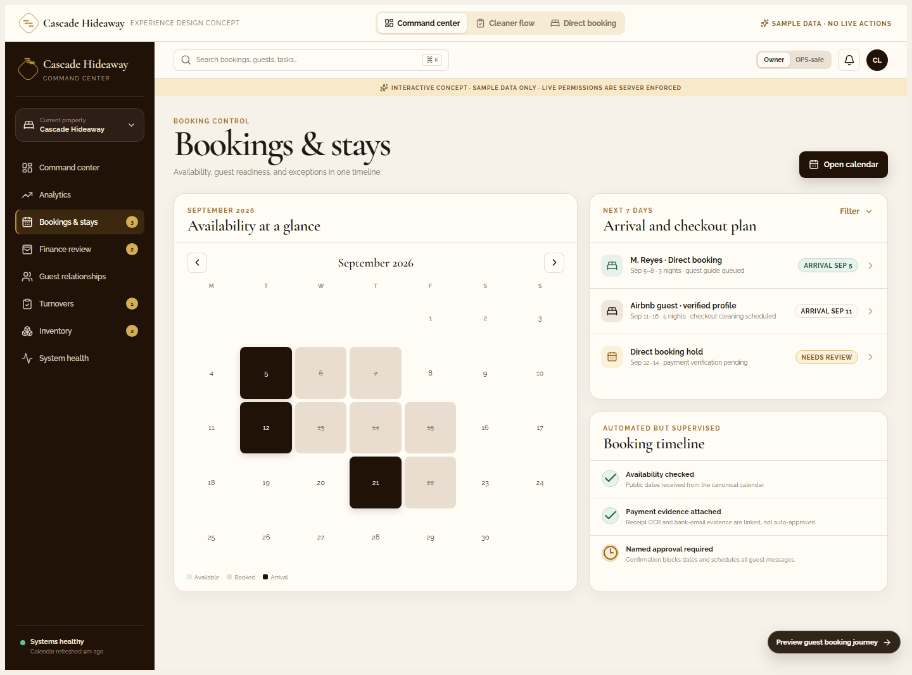
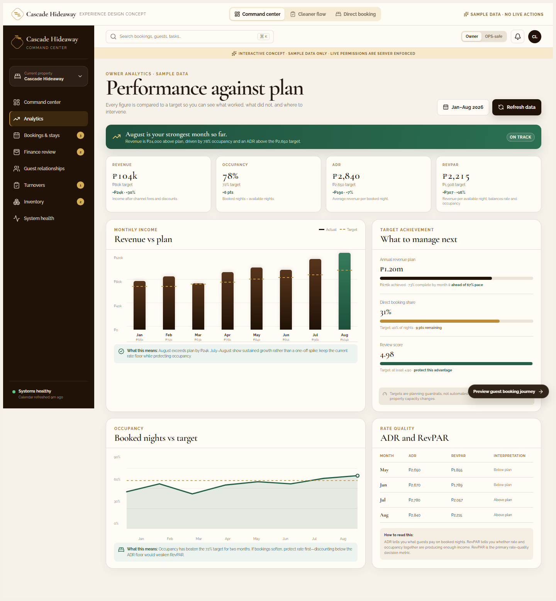
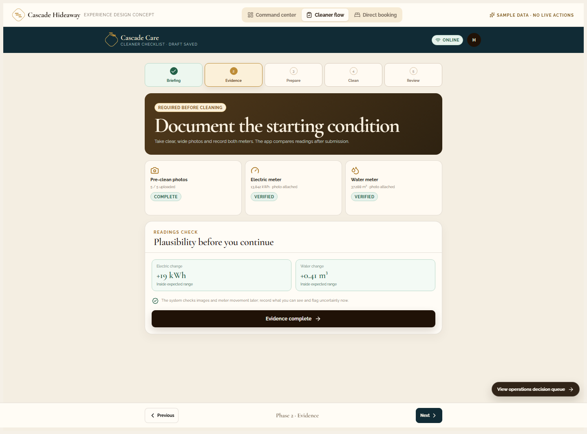
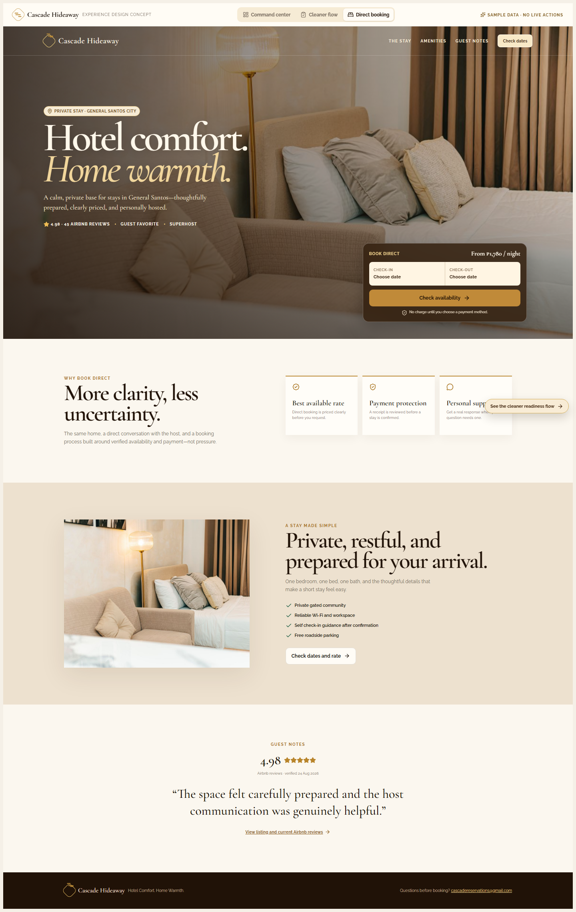
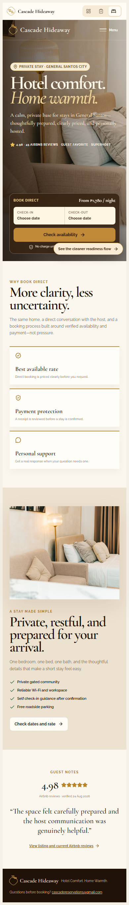
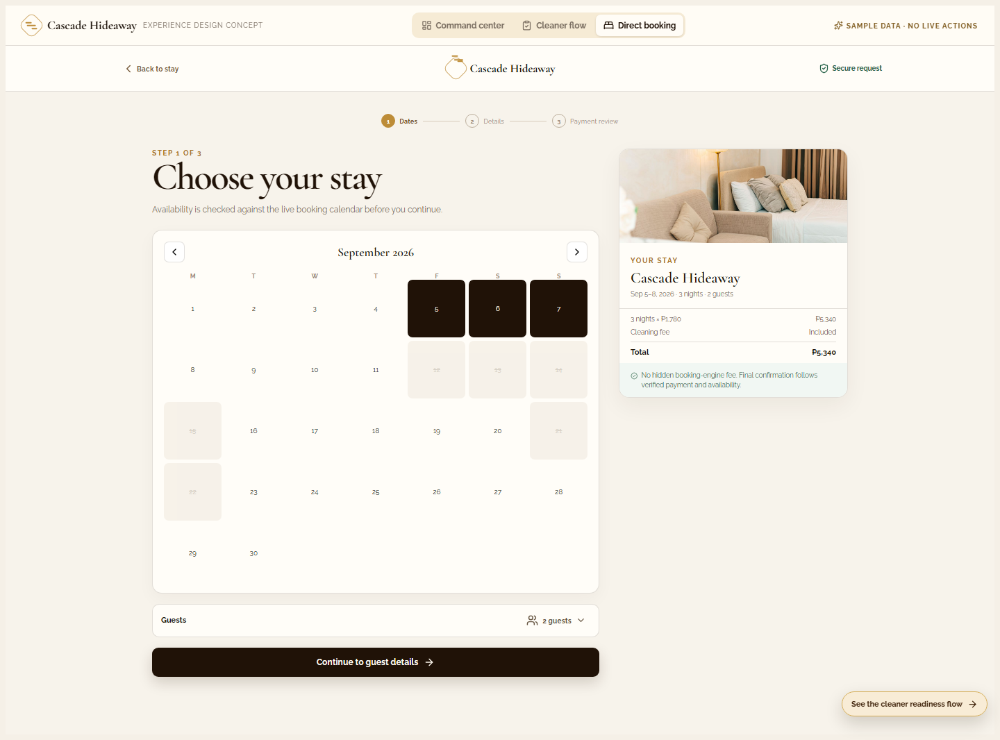

# Cascade Product Experience Redesign Audit

**Date:** 2026-08-31
**Status:** Complete interactive design suite; sample data only
**Scope:** Command Center, Cleaning Checklist, and Direct Booking Site

## Review basis

The current product designs were reviewed from their local implementations and rendered at desktop and 390px mobile widths with external business APIs blocked.

| Product | Current implementation reviewed | What is already strong |
| --- | --- | --- |
| Direct booking | `direct-booking-waves-0-1-sol/index.html` | Premium real-property photography, visible date picker, direct rate, Airbnb proof, responsive sticky booking CTA, and an existing accessible multi-step booking form. |
| Cleaner checklist | `cleaners-auth-sol/index.html` | Staff authentication, 5-phase workflow, offline draft recovery, required photo gates, previous-reading comparison, decimal water-meter assistance, issue reporting, and submission controls. |
| Command center | Existing mockup plus current Admin and Inventory dashboards | Good business data coverage, strong inventory visual identity, and a sound Finance/OPS separation requirement. |

Current-state references:

- [Direct-booking desktop capture](./audit/current-direct-booking-desktop.png)
- [Direct-booking mobile capture](./audit/current-direct-booking-mobile.png)
- [Cleaner sign-in capture](./audit/current-cleaner-auth.png)
- [Cleaner setup capture](./audit/current-cleaner-setup.png)

## Critique

### Direct booking

The present site has a strong boutique-hospitality feel. It earns trust immediately with real imagery, a high-quality headline, specific location framing, and a booking action in the first viewport. The mobile sticky CTA is also a very good conversion safeguard.

The main opportunity is not a wholesale visual change. It is reducing decision uncertainty after the first impression:

1. Explain the benefit of booking direct in plain language before asking for personal details.
2. Keep the live-date decision, total cost, deposit/full-payment choice, and confirmation rule continuously visible.
3. State clearly that a receipt is evidence, not an automatic payment confirmation. This protects guests and Cascade from fraud or double-booking confusion.
4. Treat availability, guest details, and payment review as three short, named steps rather than one long form.
5. Keep Airbnb proof dated and linked rather than presenting it as a live scraper.

The redesign keeps the image-led luxury direction but changes the booking message from “check dates” to “check availability, see the actual total, choose a verified payment route, then receive confirmation after review.”

### Cleaning checklist

The current checklist is operationally mature but cognitively dense. A cleaner sees a large volume of controls, explanation, input types, and optional paths before the underlying task sequence is clear. That is appropriate for an expert tool, but it can increase skipped evidence, uncertainty, and training time on a busy turnover.

The redesign does not remove any control requirement. It reorders them into one clear question per phase:

| Phase | Cleaner question | Required result |
| --- | --- | --- |
| Briefing | What stay and deadline am I preparing for? | Correct property, turnover context, and draft protection visible. |
| Evidence | What did the unit and meters look like before cleaning? | Clear photos, readings, and issue declaration. |
| Prepare | What must be opened, checked, and allowed to dwell? | Safe start and chemical-timer state. |
| Clean | What remains in this room? | Completed tasks or an explicit issue flag. |
| Review | What will be submitted and what can happen next? | Explainable pass/correction/escalation result. |

This preserves automatic rejection for deterministic missing/invalid evidence, inspection flags for uncertain conditions, and a human override/audit path.

### Command center

The prior mockup used placeholders for Bookings & Stays, Guest Relationships, Turnovers, and System Health. Those prevented it from being a credible full-system reference. The completed version now includes each one, with the same visual system and explicit boundaries:

- Booking timeline combines availability, arriving/checking-out stays, holds, and named approval.
- Guest CRM distinguishes automatic answers from situations that require escalation.
- Turnovers show checklist, photo, meter, and issue evidence as separate status dimensions.
- System health identifies freshness and dependencies without exposing secrets.
- Owner and OPS-safe previews prevent finance amounts and sensitive guest details from appearing in the operational view.

## Research translated into the design

Research was used as guidance, not as a source of unverified performance claims.

- Stripe’s current hotel direct-booking guidance highlights payment flexibility, transparent checkout, and reducing the friction that sends a guest back to an OTA. The redesigned direct flow makes the total, 50% reservation fee, full-payment option, and review boundary explicit. [Stripe: Direct booking optimization for hotels](https://stripe.com/resources/more/direct-booking-optimization-for-hotels)
- WCAG 2.2 requires a minimum 24×24 CSS-pixel pointer target or sufficient spacing, and emphasizes reflow and touch alternatives. The mockups use labeled controls, keyboard-visible focus, one-column small-screen forms, and comfortably sized controls. [W3C: WCAG 2.2 target size](https://www.w3.org/WAI/standards-guidelines/wcag/new-in-22/)
- W3C’s mobile guidance reinforces single-column inputs, reflow, and avoiding forced two-dimensional scrolling. The cleaner and booking views therefore have dedicated mobile layouts rather than merely shrinking desktop cards. [W3C: WCAG 2.2 on mobile](https://www.w3.org/TR/wcag2mobile-22/)

## Redesigned mockup suite

[Open the complete interactive suite](./cascade-experience-mockups.html)

The suite has three top-level product switchers and preserves a single shared Cascade visual language: mahogany, champagne gold, warm cream, Cormorant Garamond, Raleway, restrained surface depth, and real property imagery.

### Command Center

| Screen | Purpose |
| --- | --- |
| Command center | Attention-first daily overview, decision queue, readiness, and forward view. |
| Analytics | Monthly revenue, occupancy, ADR, and RevPAR compared with targets, variances, and an explicit decision interpretation. |
| Bookings & stays | Availability grid, arrival/check-out plan, and supervised booking timeline. |
| Finance review | Evidence agreement vs. manual review and the named-approval audit trail. |
| Guest relationships | Inbox state, escalation boundary, suggested response, and approval handoff. |
| Turnovers | Deterministic correction, AI uncertainty, and human override model. |
| Inventory runway | Booking-informed stock recommendation with no automatic supplier ordering. |
| System health | Service freshness and dependencies without credentials or sensitive details. |

### Cleaner checklist

The cleaner concept is intentionally mobile-first. Its phase buttons can be opened directly for training or recovery, while the normal next/previous route keeps the worker focused on the immediate safe action.

### Direct booking

The direct-booking concept contains a guest-facing home page and an interactive three-step journey:

1. Choose dates and guests against a clear availability state.
2. Give only the details necessary for the booking.
3. Select a payment route, understand the verification path, then request payment instructions.

The confirmation screen explicitly says receipt upload is evidence for review, not a declaration that payment was received. This matches Cascade’s approved workflow: admin/finance confirmation occurs only after availability and payment verification.

## Implementation priorities

### P0 — preserve business safety

1. Enforce Finance/Admin/Owner authorization server-side. The OPS-safe UI is a design demonstration, not an authorization mechanism.
2. Keep Supabase as the canonical source of booking and calendar state; n8n orchestrates actions but does not become the source of truth.
3. Require named payment approval before confirmation, calendar blocking, CRM/ledger writes, and guest confirmation.
4. Retain cleaning evidence, meter readings, AI decision reason, human reviewer, and override reason in an audit trail.
5. Stop inventory automation at recommendation and approval; never submit supplier orders automatically.

### P1 — first product implementation sequence

1. Apply the direct-booking three-step layout to the existing proven availability and submission endpoints without altering their security contracts.
2. Implement the shared dashboard shell and Bookings & Stays view as read-only Supabase views first.
3. Build the cleaner phase shell over the existing auth, draft, photo, and submit functions; do not remove offline behavior or upload retry controls.
4. Add the Turnovers decision view after the cleaner evidence schema and verifier outputs are stable.
5. Add the Guest Relationships and System Health views once the relevant workflows have consistent state and observability data.

## Validation

- Current applications rendered with business API and analytics requests blocked during critique.
- New suite compiled with TypeScript and a production Vite build.
- Source lint passed.
- Portable suite contains the Cascade property image as embedded data, so the local HTML preview has no image dependency.
- Desktop and 390px mobile renders have no horizontal overflow.
- The complete flow has no placeholder screens and no unnamed buttons.
- No production source, Supabase data, n8n workflow, external message, or deployment was changed.
