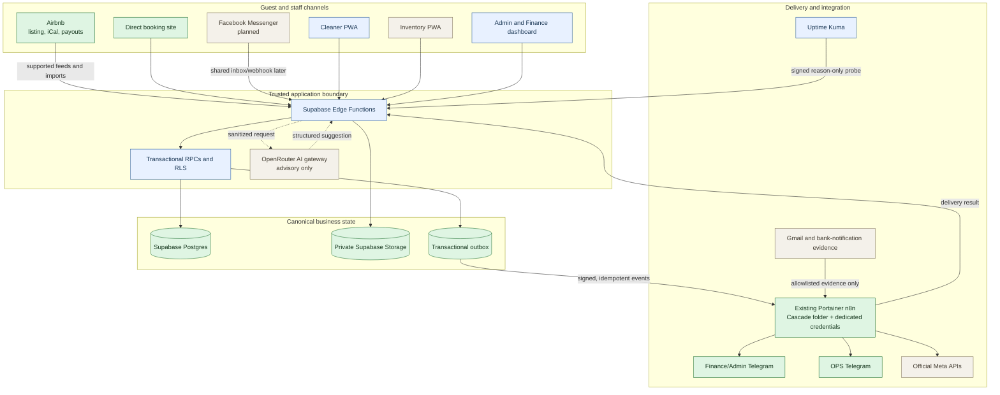
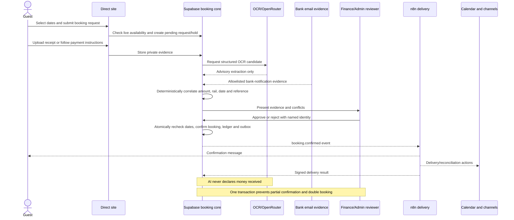
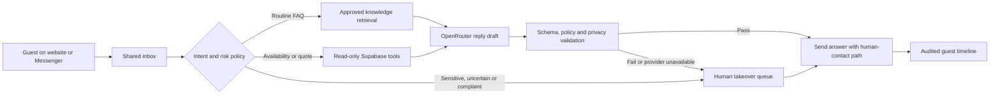
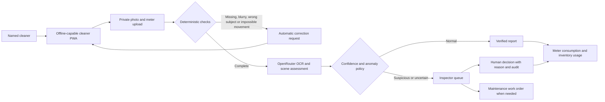
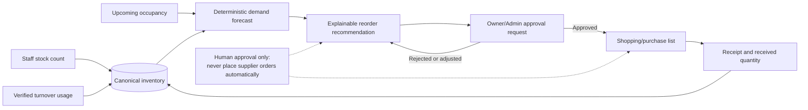
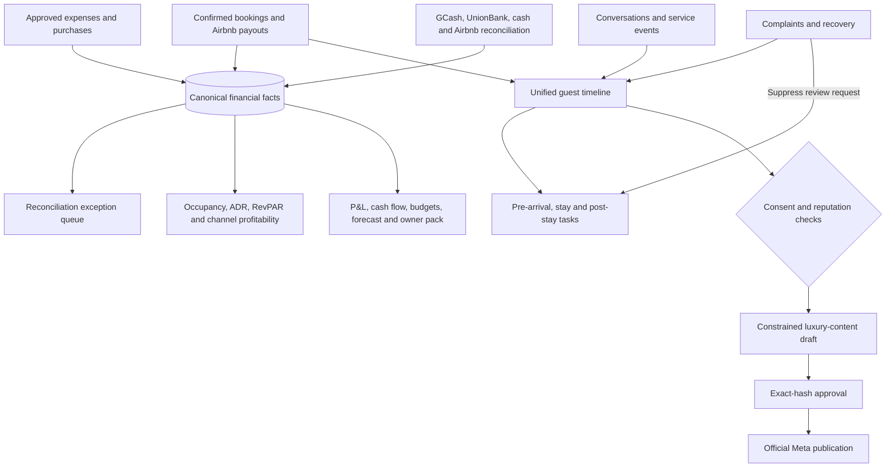

# Cascade Hideaway Business System

## Current plan, component status, architecture and business value

**Status date:** 2026-08-31

**Evidence baseline:** branch `codex/cascade-waves-0-1-sol`, commit `3cb603e`

**Interactive status artifact:** [`docs/handoff/cascade-system-plan.html`](../handoff/cascade-system-plan.html)

**Business scale:** one property now, designed for up to three properties

**Primary objective:** operate Cascade Hideaway with a customer-centred, largely self-hosted system instead of subscribing to a commercial property-management system.

> This document distinguishes what is already live, what is complete and tested locally, what is blocked by a production gate, and what is still only planned. “Complete locally” does not authorize deployment or activation.

## 1. Executive summary

Cascade already has working guest, staff and operational applications. The plan does not replace them all at once. It makes Supabase the canonical business system, keeps the existing Portainer-managed n8n instance as the delivery/orchestration layer, and improves each customer and staff workflow in priority order.

The safety foundation, called Wave 0 or Module A, is substantially complete in source code and local verification. Important narrow security protections are already active in production. The remaining foundation work is a controlled production cutover that requires owner MFA, a real cleaner identity, fresh backup/preflight evidence, scheduler and liveness secrets, and an approved n8n restore exercise.

The business-feature roadmap—atomic booking confirmation, guest chatbot, cleaning AI, inventory forecasting, finance analytics, CRM, selective marketing and final consolidation—has complete architecture-level plans but has not yet been implemented as the new canonical system. Wave 1 must not begin until Module A’s production gates are closed or explicitly re-sequenced.

**Latest planning artifact work:** The product contract and developer handoff are complete locally. The mockup suite now covers the Command Center, Cleaner Checklist, Direct Booking journey, actual-versus-forecast outlook, target-driven analytics, operating P&L, cost per available night, and daily utility baselines. These values are sample-only; Wave 5 must calculate them from reconciled canonical facts and effective-dated owner targets.

**Module A readiness refresh (2026-08-31):** local platform-safety tests, staff/cleaner release preflight, inactive n8n export validation, disposable n8n recovery, production-inventory comparison and secret scanning all passed. A disposable Supabase rerun was interrupted before final evidence and safely cleaned up, so the prior successful recovery record remains authoritative. See `docs/validation/2026-08-31-module-a-readiness-refresh.md` and the action-time sequence in `docs/plans/2026-08-31-module-a-cutover-packet.md`.

## 2. Status legend

| Marker | Meaning |
|---|---|
| ✅ Live | Deployed or actively operating, with evidence. |
| 🟢 Local release candidate | Implemented, tested and committed; production deployment is still gated. |
| 🟡 Partial / gated | Some parts exist, but a required dependency, approval or cutover remains open. |
| ⚪ Planned | Architecture and task plan exist; implementation has not started. |
| ⏸ Deferred | Intentionally postponed because it is unnecessary at the present scale or needs a later trigger. |

## 3. System architecture

### Architectural rules

1. **Supabase is authoritative.** Bookings, payments, calendars, guests, cleaning records, inventory, finance records and approvals are stored in canonical tables—not in Telegram, n8n or AI memory.
2. **n8n performs delivery and integration.** It consumes signed outbox events, runs timers and provider adapters, and reports results. It cannot independently confirm a booking or payment.
3. **AI is advisory.** OpenRouter can classify intent, extract OCR candidates, assess images and draft text. Deterministic code validates its output. AI cannot confirm payment, create a final financial decision or bypass human approval.
4. **Human authority is retained for high-risk actions.** Payment confirmation, discounts, refunds, exceptions, inspection overrides, purchases and social publication require authorized human action.
5. **Finance and OPS remain separated.** Finance/Admin receives booking, administrative and monetary detail. OPS receives only operational and staff information. Payment totals, receipts, bank data, rates, deposits, refunds and guest contact data must never enter OPS.
6. **Every domain is property-scoped.** New data includes `property_id` or inherits it through an immutable relationship so the design can grow safely to three properties.

## 4. Component inventory and current status

| Component | Responsibility | Current state | Remaining work |
|---|---|---|---|
| Direct booking site | Public property information, quote/request flow and payment instructions | ✅ Existing site operates; backend security work is active | Connect the final booking state machine, live rate/policy versions, atomic approval and delivery status |
| Supabase Postgres | Canonical bookings, guests, calendar, finance, cleaning, inventory, audit and outbox | 🟡 Existing production backend plus verified security fixes | Deploy coordinated staff/RLS/privacy packets after gates; implement Wave 1–8 domain additions |
| Edge Functions and RPC boundary | Authentication, validation, atomic business transitions and provider-safe APIs | 🟢 Twelve recovered functions now have tested privacy-safe observability; unsafe endpoints remain blocked | Controlled deployment per owning release; build booking, AI, chatbot and reporting endpoints |
| Admin/Finance dashboard | Payment review, approvals, exceptions, finance and owner oversight | 🟡 Existing application; staff authorization foundation is local | Add the atomic booking review action, inspection queues, purchase approvals, analytics and CRM views |
| Cleaner PWA | Named cleaner sign-in, checklist, private photos, meter readings and expense claims | 🟢 Authenticated cleaner release candidate is complete locally | Production cutover with real cleaner account; Wave 3 deterministic and AI verification |
| Inventory PWA | Stock counts, usage, reorder and purchase-approval interface | 🟡 Existing operational application | Lock canonical access, make usage idempotent, add explainable reorder forecasts and approvals |
| Telegram assistant | Finance/Admin decisions and OPS operational advisories | 🟡 Route guard is live; existing bot/workflows exist | Add approved reminders, OCR review, booking lifecycle, cleaning and inventory events without Finance leakage to OPS |
| Existing Portainer n8n | Timers, outbox delivery, Gmail/provider adapters and callbacks | 🟡 Runtime exists; 13 source-controlled workflows validate and remain inactive | Create/verify dedicated Cascade credentials, resolve duplicate W01 drafts, restore-test DB/credentials/key, approve workflows individually |
| Dedicated Cascade Docker stack | Optional future n8n isolation | ⏸ Deferred | Migrate only after recurring outages, failed credential isolation, Alfred/Alex impact, or multi-property/staff scale |
| OpenRouter gateway | Pinned task profiles for chat, OCR, vision, analysis and content drafts | ⚪ Planned; degraded-mode rules are implemented locally | Build gateway, schemas, model evaluation, privacy minimization, fallbacks and usage controls |
| Shared inbox / Chatwoot | Direct-site chat, Messenger, human takeover and conversation audit | ⚪ Planned | VPS capacity gate; otherwise use the lightweight Supabase inbox fallback; create Meta assets |
| Gmail evidence adapter | Allowlisted bank-notification evidence for payment review | ⚪ Planned | Configure authorized mailbox access, minimize metadata and correlate evidence deterministically |
| Cleaning and meter verifier | Required-evidence validation, OCR, room-condition assessment and human override | ⚪ Advanced verifier planned; capture foundations exist | Implement Wave 3 rules, calibration, inspection queue and maintenance work orders |
| Finance and analytics | Reconciliation, P&L, cash flow, occupancy, ADR, RevPAR, budgets and forecasts | ⚪ Canonical Wave 5 system planned; legacy reporting exists | Build reconciled management facts, exception workbench, owner pack and registration-ready exports |
| Guest CRM | One guest identity, history, consent, tasks and service recovery | ⚪ Planned over existing guest records | Identity resolution, timeline, lifecycle automation and complaint-aware review workflow |
| Selective marketing | Luxury content drafting, approval, consent and official Meta publication | ⚪ Planned | Build asset/approval records and exact-hash publishing; all posts require approval for at least 90 days |
| Observability and recovery | Correlation IDs, redacted logs, degraded mode, heartbeats, backups and safe releases | 🟢 Complete locally; narrow production protections active | Deploy liveness safely, configure Uptime Kuma, close runtime restore proof and use release contracts for cutovers |

## 5. Roadmap status by wave

| Wave / module | Outcome | Status | Evidence or gate |
|---|---|---|---|
| Wave 0.1–0.4 | Production inventory, source recovery, runtime decision and Finance/OPS boundary | ✅ Complete; Finance/OPS guard deployed | 21 deployed functions inventoried; 12 recovered and 9 versioned; existing Portainer n8n approved |
| Wave 0.5 | Property-scoped operational RLS | 🟢 Local release candidate | 63 pgTAP assertions pass; must deploy with staff and cleaner packet |
| Wave 0.6 | Scheduler heartbeat and missed-run detection | 🟢 Complete locally, inactive | Scheduler secrets and activation approval remain open |
| Wave 0.7 | Automated security regression | ✅ Complete | Secret scan, endpoint manifest and inactive n8n checks pass |
| Wave 0.8 | Source and disposable recovery proof | 🟢 Complete locally | 13 n8n workflows round-trip inactive; 28 migrations and 15 database tests pass; shared runtime restore remains gated |
| Wave 0.9 | Named staff, cleaner authorization, MFA and revocation | 🟢 Local release candidate | Owner MFA, real cleaner assignment and coordinated production smoke test remain open |
| Wave 0.10 | Privacy requests, holds and audit | 🟢 Local release candidate | 49 pgTAP assertions pass; legal/privacy review, owner MFA, backup and deployment approval remain open |
| Wave 0.11 | Correlation, redaction, degraded mode and independent liveness | 🟢 Local release candidate | 37 Node and 35 Deno tests pass; liveness secret/deployment/Uptime Kuma remain open |
| Wave 0.12 | Safe database release and rollback discipline | 🟢 Complete locally | First production use requires fresh backup, preflight and approval |
| Wave 1 | Reliable booking, calendar and payment review | 🟡 Local source work re-sequenced | Owner deferred Module A recovery exercise on 2026-09-01; local implementation/tests may proceed, but deployment remains blocked until Module A gates close |
| Wave 2 | Guest chatbot and shared inbox | ⚪ Not started | Requires approved knowledge base, OpenRouter gateway and Meta/shared-inbox setup |
| Wave 3 | Cleaning and meter verification | ⚪ Not started beyond cleaner foundations | Requires versioned evidence contract and consented calibration set |
| Wave 4 | Inventory forecasting and purchase approval | ⚪ Not started | Recommendation and approval only; automatic ordering is prohibited |
| Wave 5 | Finance, reconciliation and management analytics | ⚪ Not started | Internal management reporting only until registration/accountant configuration exists |
| Wave 6 | CRM and guest service lifecycle | ⚪ Not started | Extends Supabase; no separate heavy CRM at current scale |
| Wave 7 | Selective luxury marketing | ⚪ Not started | Exact-content approval and official Meta publishing required |
| Wave 8 | Application consolidation and handoff | ⚪ Not started | Final stage after domain workflows are proven |

## 6. How each major workflow will operate

### 6.1 Direct booking, payment review and calendar protection

**Business result:** fewer double-booking and payment-fraud risks, faster confirmation after review, one audit trail and fewer manual updates across calendar, ledger and guest records.

### 6.2 Guest chatbot and human handoff

**Business result:** routine questions receive fast and consistent answers while discounts, payments, cancellations, complaints, access and safety issues reach a person with the conversation context intact.

### 6.3 Cleaning, photo and meter verification

**Business result:** incomplete reports are corrected quickly, suspicious conditions receive human attention, utility consumption is based on retained evidence, and defects become trackable maintenance rather than disappearing in chat.

### 6.4 Inventory recommendation and purchase approval

**Business result:** fewer stockouts, less overbuying, clearer accountability and purchase decisions tied to real usage and expected occupancy.

### 6.5 Finance, analytics, CRM and selective marketing

**Business result:** management can see true profitability and operational exceptions, guests receive coherent service across stays, and marketing remains curated and reputation-safe instead of becoming automated posting volume.

## 7. Why this plan helps Cascade Hideaway

| Business need | How the plan addresses it | Expected operational effect |
|---|---|---|
| Prevent double bookings | Atomic confirmation rechecks availability and commits booking, ledger and outbox together | One confirmed winner during overlapping requests; no partial confirmation |
| Improve guest response | Shared inbox, approved knowledge and live availability tools with human handoff | Faster routine replies without unsafe answers or lost context |
| Reduce payment risk | Receipt OCR and bank email are advisory evidence; named Finance/Admin approval remains authoritative | Better fraud/conflict detection without AI accepting money |
| Improve cleaning quality | Deterministic rejection, private evidence, AI anomaly flagging and inspector override | Consistent turnover evidence and quicker correction before check-in |
| Control utilities and property condition | Claimed, OCR and verified readings remain separate; anomalies create review/work orders | More trustworthy consumption analysis and earlier maintenance action |
| Avoid stockouts and waste | Occupancy- and usage-based reorder recommendations with human approval | Timely purchasing without uncontrolled supplier orders |
| Understand business performance | Reconciled P&L, cash flow, occupancy, ADR, RevPAR, budgets and forecasts | Decisions based on canonical facts rather than disconnected sheets |
| Build repeat business | One guest timeline, consent, lifecycle tasks and service recovery | More personalized stays and fewer inappropriate review requests |
| Protect the luxury brand | Selective drafting, image consent and exact-content approval | Consistent, restrained publishing controlled like a boutique hotel |
| Scale safely | Property-scoped authorization, effective-dated rates/policies and isolated records | Add properties or staff without mixing access, rates or finances |
| Minimize recurring SaaS | Reuse Supabase, GitHub, existing Portainer n8n, Apps Script and open/free AI routing | PMS-like capabilities without adopting a large commercial PMS |
| Keep Cascade separate | Dedicated data, credentials, routes and financial controls | No accidental mixing with Alfred/Alex systems or accounts |

## 8. Current production gate and next executable sequence

Module A is not fully closed until the following sequence is completed with fresh action-time approval:

1. Confirm dashboard-owner TOTP is enrolled, then capture fresh production preflight, migration-ledger reconciliation, restore-point and rollback evidence.
2. Deploy the coordinated staff/RLS/named-cleaner backend packet through the approved production mechanism.
3. Create or use a named **project Auth** owner, bootstrap that identity from a database-owner session, complete project TOTP, and prove a fresh application `aal2` session. Dashboard MFA is not an application `aal2` claim.
4. Create the real cleaner project Auth identity and assign the cleaner role plus Cascade property from the project-AAL2 owner session.
5. Deploy the compatible authenticated cleaner PWA and backend artifacts together, then prove sign-in, property isolation, private photo upload, meter lookup, report submission, pending expense claim, sign-out, disabled-user denial and stale-session denial.
6. Create separate scheduler and liveness secrets without exposing their values; deploy and smoke-test the heartbeat components before schedule/Uptime Kuma activation.
7. Apply the corrected price-history view through its own reviewed release.
8. Complete an owner-approved restore exercise for the shared Portainer n8n database, credential ciphertext, encryption key and workflow set.
9. Close Module A with a production validation record, then prepare the first just-in-time Wave 1 implementation packet under SOL review.

## 9. Intentional exclusions and deferred choices

- No automated supplier ordering; the system stops at recommendation, approval and shopping list.
- No unofficial Airbnb scraping or inbox automation. Airbnb payments remain handled by Airbnb.
- No automatic BIR filing or claim of tax compliance while the business is unregistered.
- No heavy standalone PMS, Twenty CRM, QloApps or Postiz deployment at the current one-property scale.
- No smart-lock or property-device control without a separately authorized hardware phase.
- No dedicated Cascade n8n Docker stack unless the approved migration triggers occur.
- No production deployment, workflow publication, cron activation, Meta/Gmail setup or provider message merely because source code is complete.

## 10. Source-of-truth documents

- `docs/plans/module-execution-queue.md` — current executable module order and stop conditions.
- `docs/plans/HANDOFF-2026-08-30-sol-security-and-release-preflight.md` — verified production/local state and next cutover steps.
- `docs/validation/2026-08-31-wave-0-observability-adoption.md` — latest Wave 0.11 evidence.
- `docs/validation/2026-08-31-wave-0-privacy-enforcement.md` — Wave 0.10 evidence.
- `docs/validation/2026-08-30-wave-0-recovery-report.md` — recovery method and remaining runtime gate.
- Root planning workspace: `docs/plans/2026-08-28-cascade-business-system-master-blueprint.md` and Wave 0–8 plans.

This document is a status and architecture briefing. The individual plan, runbook, release-contract and validation files remain authoritative for execution details.
